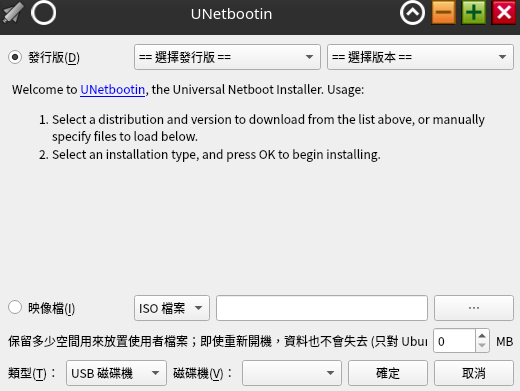
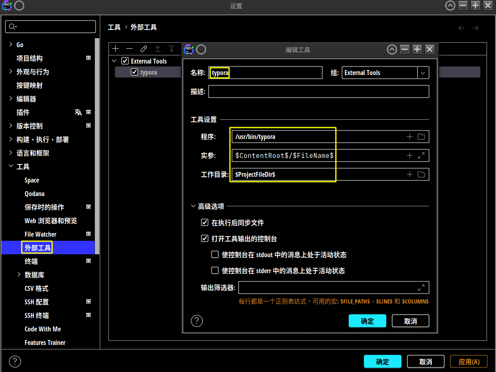

# toolsExplainedz

## Unetbootin

[unetbootin github](https://unetbootin.github.io/linux_download.html)

### Install

```bash
$ wget https://github.com/unetbootin/unetbootin/releases/download/702/unetbootin-linux64-702.bin

$ sudo cp ./unetbootin-linux64-702.bin /unetbootin
```

### Start

```bash
$ sudo /usr/local/bin/unetbootin
```

 

### Insert usb drvier

```bash
$ cfdisk /dev/sdX # Only keep one partition /dev/sdX1 

$ mkfs.vfat /dev/sdX1
```

## Synergy

This tool is used to `share mouse and keyboard across multiple computers`.

Because computer memory is getting bigger and bigger now, my computer memory is up to 32G, the next one may be up to 64G, the previous one only has 16G, the new computer must be better, it’s a pity that the old computer has been thrown away, why not use software to `piece them together`, now the total available memory of the computer can be 48G. 

I have tried three sets of software, `Synergy(Beta), Barrier and x2x`.

Among them, `Synergy is the best to use`, possibly because there are too many different operating systems.

For example, some operating systems `cannot control other computers`, but some can.

Even if you choose for Synergy(Beta), there are still problems.

### Issue

I record the following issues:

#### Synergy:

1. Sometimes the mouse cannot cross the screen directly, you may have to `set your own shortcuts`, such as CTRL plus 5 and 6 2.
2. Debian cannot control the mouse on Ubuntu, but Ubuntu cannot control the mouse on Debian, so I can only `set Ubuntu as the server`.

#### Barrier:

Barrier `does not automatically generate TLS encryption keys`, you have to generate them yourself.

```bash
$ cd /home/panhong/snap/barrier/682/.local/share/barrier/SSL/

$ openssl req -x509 -nodes -days 365 -subj /CN=Barrier -newkey rsa:4096 -keyout Barrier.pem -out Barrier.pem
```

### Set up firewall

```bash
$ iptables -A INPUT -p tcp --dport 24800 -j ACCEPT
$ iptables -A INPUT -p tcp --dport 24802 -j ACCEPT

sudo iptables -A INPUT -p tcp -m multiport --dports 24800:3005 -j ACCEPT

# Configure ubuntu with gufw
$ apt-get install gufw
```

### Product related support

https://symless.com/synergy/contact-support?topic=Synergy+3+Beta

(2023/5/21)

## Linux Swappiness

Swappiness is the kernel parameter that defines how much (and how often) your Linux kernel will copy RAM contents to swap.

This parameter's default value is “60” and it can take anything from “0” to “100”.

`The higher the value` of the swappiness parameter, `the more aggressively your kernel will swap`.

Now my system has 31G of physical memory. If I set `swappiness = 5`, it means that the system will start using swap when the memory is left with 31000 MB * 5% = `1550 MB`.

```bash
# Set swappiness
$ vim /etc/sysctl.conf
# vm.swappiness = 5 # edit here !

# Clear the current swap space
$ sudo swapoff -a
$ sudo swapon -a

# Reload swappiness
$ sudo sysctl -p
```

Swap space can stop Linux from using `OOM killer`.

This is a part of the Linux kernel that `kills programs that use too much memory`.

But using swap can make the system slower.

## Alternatives

Installing a new version of Golang.

This method allows multiple versions of Golang to coexist.

Downloading the new compiler

```bash
$ sha256sum /home/panhong/下載/go1.20.3.linux-amd64.tar.gz
# 979694c2c25c735755bf26f4f45e19e64e4811d661dd07b8c010f7a8e18adfca
# (Copy and paste the SHA256 checksum and search for it on the website.)
```

Perform alternative installation

```bash
# Place the new version of the golang folder
$ sudo cp /home/panhong/下載/go1.20.3.linux-amd64.tar.gz /usr/local/
$ sudo su -
$ cd /usr/local/
$ tar -zxvf go1.20.3.linux-amd64.tar.gz -C ./
$ mv go go-1.20.3

# Set up the new version of golang
$ update-alternatives --install /usr/bin/go go /usr/local/go-1.20.3/bin/go 150 --slave /usr/bin/gofmt gofmt /usr/local/go-1.20.3/bin/gofmt
$ update-alternatives --config go

# Remove the old version of golang
$ update-alternatives --remove go /usr/local/go-1.19.2/bin/go

# Run the new version of golang
$ exit # Exit root
$ go version
# go version go1.20.1 linux/amd64
```

Use the following command to remove the old version of Golang:

```bash
$ update-alternatives --list go
# /usr/lib/go-1.15/bin/go
# /usr/local/go-1.19.2/bin/go # remove !
# /usr/local/go-1.20.1/bin/go
# /usr/local/go-1.9/bin/go

$ sudo rm /usr/local/go1.19.2.linux-amd64.tar.gz
$ sudo update-alternatives --remove go /usr/local/go-1.19.2/bin/go
$ sudo rm -rf /usr/local/go-1.19.2
```

## Goland

### External tools settings

> [Jetbrains Reference](https://www.jetbrains.com/help/idea/settings-tools-external-tools.html)

typora

| options           | parameters               |
| ----------------- | ------------------------ |
| name              | typora                   |
| program           | /usr/bin/typora          |
| arguments         | $ContentRoot$/$FileName$ |
| working directory | $ProjectFileDir$         |

 

## AI tools

### Claude

[Slack Login](https://slack.com/intl/zh-tw/)

[Add To Slack](https://www.anthropic.com/claude-in-slack)

### ChatGPT

[ChatGPT Desktop In Sanp](https://snapcraft.io/chatgpt-desktop)

### Perplexity

[Perplexity In Web](https://www.perplexity.ai/)

[Perplexity In Edge](https://chrome.google.com/webstore/detail/perplexity-ask-ai/hlgbcneanomplepojfcnclggenpcoldo/related)


