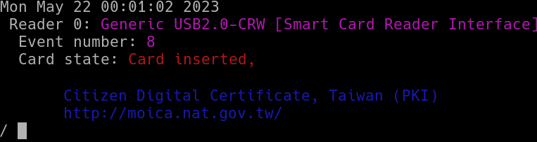
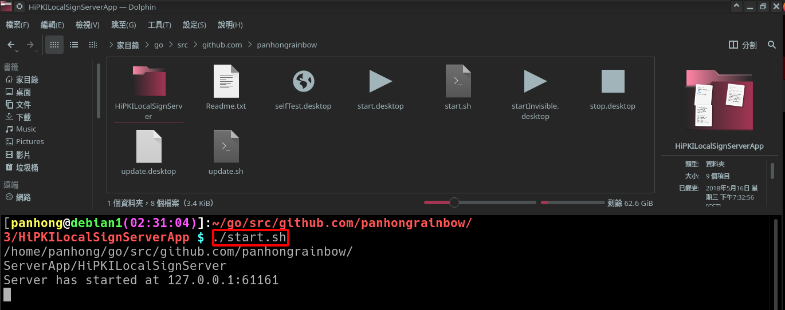
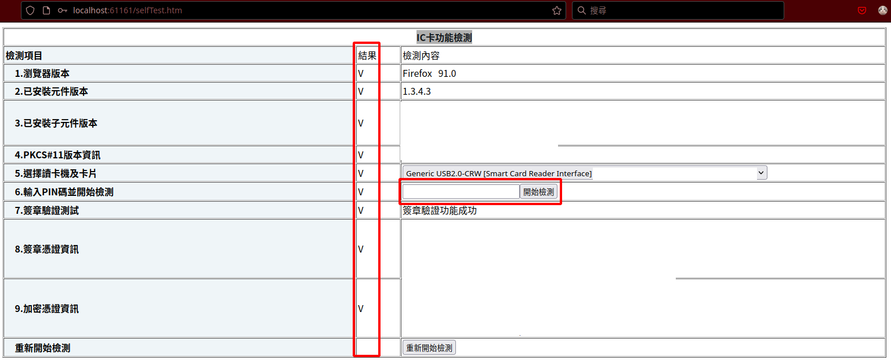
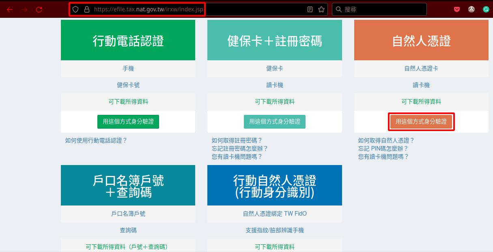
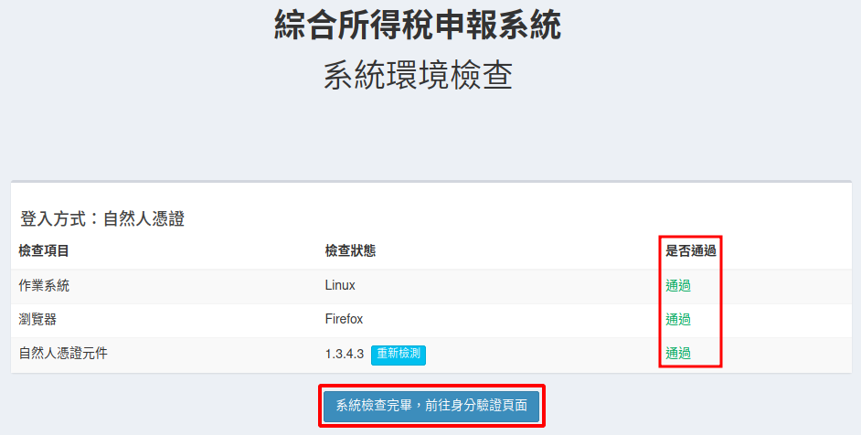
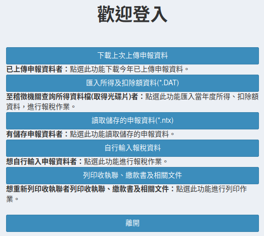

# toolsExplainedz

## L2TP VPN

Install VPN package 

```bash
$ apt-get install libreswan # For debian, just install this package on debian, no other configuration is needed to run VPN !

$ apt-get install network-manager-l2tp  network-manager-l2tp-gnome libreswan # for ubuntu
```

IPSEC is used for encryption. Its configuration files need to be modified

```bash
$ vim /etc/ipsec.conf 
```

The content is as follows

```
root@debian6:~# cat /etc/ipsec.conf 
# /etc/ipsec.conf - Libreswan 4.0 configuration file
#
# see 'man ipsec.conf' and 'man pluto' for more information
#
# For example configurations and documentation, see https://libreswan.org/wiki/

config setup
        ikev1-policy=accept
```

Start the VPN encryption service

```bash
$ systemctl start ipsec.service # Start encryption service
$ systemctl enable ipsec.service

$ systemctl stop xl2tpd # It will take up port 1701, causing VPN startup failure 
$ systemctl disable xl2tpd
```

Debug command

```bash
$ /usr/lib/NetworkManager/nm-l2tp-service --debug # Start the VPN connection of KDE at the same time, you can see the following message (要同启动 KDE 的 VPN 连线)
# Account and password information can be displayed in the middle for debugging (中间会显示帐号和密码，方便进行除错)
# xl2tpd[12345]: start_pppd: I'm running:
# xl2tpd[12345]: "/usr/sbin/pppd" 
# xl2tpd[12345]: "plugin" 
# xl2tpd[12345]: "pppol2tp.so" 
# xl2tpd[12345]: "pppol2tp"
```

## Personal Card

### Insert the card

```bash
# install PC/SC Packages
$ root> sudo apt-get update
$ root> sudo apt-get install pcscd pcsc-tools
$ root> reboot

# No root permission is required for testing
$ panhong> pcsc_scan
#   Event number: 0

# 错错错错错 !!!!!
# Card state: Card inserted, Unresponsive card, (this is an abnormal message !!!!! )

# 正确 正确 正确 正确 正确 !!!!!
# Citizen Digital Certificate, Taiwan (PKI)
#       http://moica.nat.gov.tw/ (this is a normal message !!!!!)

# 把卡翻面
# Sometimes it's because the card is plugged in upside down, you really have to flip the card over.
```

 As shown below

 

### Check status

Download `Natural Personal Certificate Web Components`  from [this link](https://moica.nat.gov.tw/rac_plugin.html)

```bash
# Enter the component folder
$ cd /home/panhong/go/src/github.com/panhongrainbow/toolsExplainedz/Natural\ Personal\ Certificate\ Web\ Components/ 
# Download Natural Personal Certificate Web Components
$ wget https://api-hisecurecdn.cdn.hinet.net/HiPKILocalSignServer/linux/HiPKILocalSignServerApp.tar.gz
```

Execute Natural Personal Certificate Web Components

```bash
# Enter the component folder
$ cd /home/panhong/go/src/github.com/panhongrainbow/toolsExplainedz/Natural\ Personal\ Certificate\ Web\ Components/1.3.4.3/HiPKILocalSignServerApp 
# Execute Natural Personal Certificate Web Components
$ ./start.sh 
```

As shown below

 

1. Open `IC card function test address` from [this link](http://localhost:61161/selfTest.htm)

2. Enter `your birthday`

   (`The default value` is to count from the early years of the Republic of China, which is the former dynasty of China)

3. Next to run `IC card self-test`, must `pass all` 

 

### Declare income tax

Log in to  [the income tax portal website](https://efile.tax.nat.gov.tw/irxw/index.jsp), click Under the natural person certificate, start this processing in this way.


System environment check, must pass all, then click System check completed, go to `identity verification page`.


Enter `ID number and birthday(default pin code)`, click `Execute identity verification`


Enter the income tax page


## Unetbootin

[unetbootin github](https://unetbootin.github.io/linux_download.html)

### Install

```bash
$ wget https://github.com/unetbootin/unetbootin/releases/download/702/unetbootin-linux64-702.bin

$ sudo cp ./unetbootin-linux64-702.bin /unetbootin
```

### Start

```bash
$ sudo /usr/local/bin/unetbootin
```

 

### Insert usb drvier

```bash
$ cfdisk /dev/sdX # Only keep one partition /dev/sdX1 

$ mkfs.vfat /dev/sdX1
```

## Synergy

This tool is used to `share mouse and keyboard across multiple computers`.

Because computer memory is getting bigger and bigger now, my computer memory is up to 32G, the next one may be up to 64G, the previous one only has 16G, the new computer must be better, it’s a pity that the old computer has been thrown away, why not use software to `piece them together`, now the total available memory of the computer can be 48G. 

I have tried three sets of software, `Synergy(Beta), Barrier and x2x`.

Among them, `Synergy is the best to use`, possibly because there are too many different operating systems.

For example, some operating systems `cannot control other computers`, but some can.

Even if you choose for Synergy(Beta), there are still problems.

### Issue

I record the following issues:

#### Synergy:

1. Sometimes the mouse cannot cross the screen directly, you may have to `set your own shortcuts`, such as CTRL plus 5 and 6 2.
2. Debian cannot control the mouse on Ubuntu, but Ubuntu cannot control the mouse on Debian, so I can only `set Ubuntu as the server`.

#### Barrier:

Barrier `does not automatically generate TLS encryption keys`, you have to generate them yourself.

```bash
$ cd /home/panhong/snap/barrier/682/.local/share/barrier/SSL/

$ openssl req -x509 -nodes -days 365 -subj /CN=Barrier -newkey rsa:4096 -keyout Barrier.pem -out Barrier.pem
```

### Set up firewall

```bash
$ iptables -A INPUT -p tcp --dport 24800 -j ACCEPT
$ iptables -A INPUT -p tcp --dport 24802 -j ACCEPT

sudo iptables -A INPUT -p tcp -m multiport --dports 24800:3005 -j ACCEPT

# Configure ubuntu with gufw
$ apt-get install gufw
```

### Product related support

https://symless.com/synergy/contact-support?topic=Synergy+3+Beta

(2023/5/21)

## Linux Swappiness

Swappiness is the kernel parameter that defines how much (and how often) your Linux kernel will copy RAM contents to swap.

This parameter's default value is “60” and it can take anything from “0” to “100”.

`The higher the value` of the swappiness parameter, `the more aggressively your kernel will swap`.

Now my system has 31G of physical memory. If I set `swappiness = 5`, it means that the system will start using swap when the memory is left with 31000 MB * 5% = `1550 MB`.

```bash
# Set swappiness
$ vim /etc/sysctl.conf
# vm.swappiness = 5 # edit here !

# Clear the current swap space
$ sudo swapoff -a
$ sudo swapon -a

# Reload swappiness
$ sudo sysctl -p
```

Swap space can stop Linux from using `OOM killer`.

This is a part of the Linux kernel that `kills programs that use too much memory`.

But using swap can make the system slower.

## Alternatives

Installing a new version of Golang.

This method allows multiple versions of Golang to coexist.

Downloading the new compiler

```bash
$ sha256sum /home/panhong/下載/go1.20.3.linux-amd64.tar.gz
# 979694c2c25c735755bf26f4f45e19e64e4811d661dd07b8c010f7a8e18adfca
# (Copy and paste the SHA256 checksum and search for it on the website.)
```

Perform alternative installation

```bash
# Place the new version of the golang folder
$ sudo cp /home/panhong/下載/go1.20.3.linux-amd64.tar.gz /usr/local/
$ sudo su -
$ cd /usr/local/
$ tar -zxvf go1.20.3.linux-amd64.tar.gz -C ./
$ mv go go-1.20.3

# Set up the new version of golang
$ update-alternatives --install /usr/bin/go go /usr/local/go-1.20.3/bin/go 150 --slave /usr/bin/gofmt gofmt /usr/local/go-1.20.3/bin/gofmt
$ update-alternatives --config go

# Remove the old version of golang
$ update-alternatives --remove go /usr/local/go-1.19.2/bin/go

# Run the new version of golang
$ exit # Exit root
$ go version
# go version go1.20.1 linux/amd64
```

Use the following command to remove the old version of Golang:

```bash
$ update-alternatives --list go
# /usr/lib/go-1.15/bin/go
# /usr/local/go-1.19.2/bin/go # remove !
# /usr/local/go-1.20.1/bin/go
# /usr/local/go-1.9/bin/go

$ sudo rm /usr/local/go1.19.2.linux-amd64.tar.gz
$ sudo update-alternatives --remove go /usr/local/go-1.19.2/bin/go
$ sudo rm -rf /usr/local/go-1.19.2
```

## Goland

### External tools settings

> [Jetbrains Reference](https://www.jetbrains.com/help/idea/settings-tools-external-tools.html)

Typora

| options           | parameters               |
| ----------------- | ------------------------ |
| name              | typora                   |
| program           | /usr/bin/typora          |
| arguments         | $ContentRoot$/$FileName$ |
| working directory | $ProjectFileDir$         |

 

## AI tools

### Claude

[Slack Login](https://slack.com/intl/zh-tw/)

[Add To Slack](https://www.anthropic.com/claude-in-slack)

### ChatGPT

[ChatGPT Desktop In Sanp](https://snapcraft.io/chatgpt-desktop)

### Perplexity

[Perplexity In Web](https://www.perplexity.ai/)

[Perplexity In Edge](https://chrome.google.com/webstore/detail/perplexity-ask-ai/hlgbcneanomplepojfcnclggenpcoldo/related)


